# 👨‍💻 Marcos Ramírez

---

## 👋 Sobre mí / About Me

> **Español:** Desarrollador passionate por la tecnología, la IA y crear soluciones que marquen la diferencia. Siempre aprendiendo, siempre creando.

> **English:** Developer passionate about technology, AI, and building solutions that make a difference. Always learning, always creating.

---

## 🛠️ Tech Stack / Tecnologías

---

## 📊 GitHub Stats

---

## 🔗 Conecta conmigo / Connect

---

## 📝 Últimos artículos / Latest Blog Posts

<!-- BLOGPOSTS:START -->
- [⚠️ Claude lleva una semana cayéndose &lpar;y el status dice que todo va bien&rpar;](https://blog.marcosramirez.info/claude-caidas-mayo-2026/)
- [De Cloudflare Pages a Workers con Astro: la guerra real](https://blog.marcosramirez.info/cloudflare-workers-astro-migracion/)
- [Glass pads: probé el Razer Atlas Pro y no vuelvo a la tela](https://blog.marcosramirez.info/glass-pads-review-razer-atlas-pro/)
- [De VAPI a Retell: la migración que se llevó media arquitectura](https://blog.marcosramirez.info/migracion-vapi-retell/)
- [Gemini 3.5 Flash en el I/O 2026: ¿merece la pena el cambio?](https://blog.marcosramirez.info/gemini-3-5-flash-agentes-voz/)
<!-- BLOGPOSTS:END -->

---

⭐️ From [MarcosRamirez](https://github.com/MarcosRamirez)

